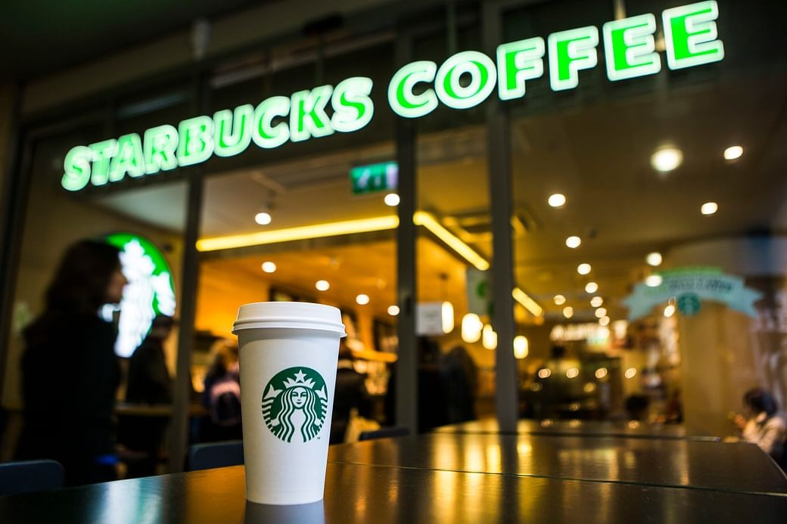

# COFFEE SALES DASHBOARD

# 📊 PROJECT OVERVIEW

This dashboard has been designed to present key insights about the operations of three stores within our coffee chain. It serves as a valuable tool to facilitate discussions with the regional manager and other higher-ups. The primary goal is to optimize store operations, improve efficiency, and drive better performance across all locations.

# ⚙️ TOOLS USED

# 🚀 PROJECT GOALS
- Maximize Revenue Growth

- Optimize Peak Day Operations

- Enhance Morning Service Efficiency

- Leverage Popular Products

- Maintain Category Leadership

- Ensure Consistency Across Locations

# 📈 INSIGHTS
Key Insights from Project

- Revenue Growth: The revenue has shown consistent growth over time, reflecting positive performance across all stores.

- Busiest Days: Mondays, Thursdays, and Fridays are generally the busiest days. This aligns with customer behavior, as people often visit coffee shops while gearing up for 
  work.

- Peak Hours: Morning hours experience the highest footfall, as customers typically stop by on their way to the office.

- Category and Product Performance: Coffee is the top-performing category, with the Barista Espresso being the most popular product across all stores.

- Consistency Across Stores: These trends remain consistent across all locations, indicating uniform customer preferences and behavior patterns.

# DATA STORY

Additional Insights and Recommendations

- Underperforming Products: The bottom-performing items across all stores include certain flavors and products like coffee beans.

- Merchandise Performance: Merchandise clothing sales at the Hell's Kitchen store are significantly lower compared to other locations.
  
Recommendations
- Offer discounts on merchandise at Hell's Kitchen to boost sales.
- Remove low-selling items from displays at Hell's Kitchen and make them available on order only.
- Optimize inventory for low-performing products to reduce operational costs.

# DASHBOARD

